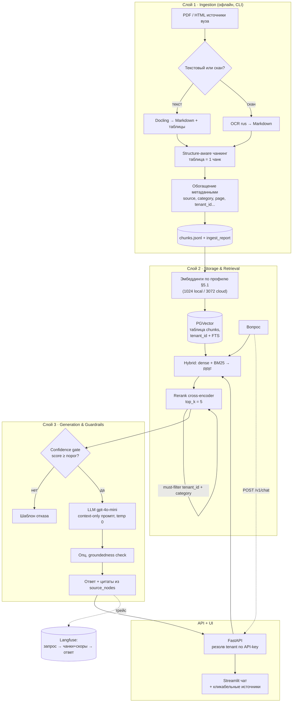

# Документ-фундамент — Smart University Knowledge Hub

> **Статус:** v1.4 (опорная версия) · **Дата:** 2026-07-03 · **Владелец решений:** akana92
> **v1.4:** синхронизация с фактическим кодом по итогам независимого аудита ([00_Current_State_Inventory](00_Current_State_Inventory.md), [01_Audit](01_Audit_Original_Spec_vs_Implementation.md)): §2.3 (имя файла стора), §13 (фактическое дерево), §14 (токенайзер/min_tokens/факт-dim), §15 (факт-статусы DoD), ADR-018/019.
> **Назначение:** единая «опорная точка» проекта. На этот документ ссылается каждый этап разработки. Любое изменение архитектуры сначала вносится сюда (через раздел §16 «Реестр решений»), и только потом — в код. Это защищает логику проекта от расползания.
> **Спутник:** [docs/02-insights-external-decks.md](02-insights-external-decks.md) — приоритизированный backlog улучшений из внешних источников (RAG-эвал, guardrails, retrieval, память агента), привязанный к разделам ниже. v1.1 уже впитал ключевые из них (§12, §14, §16 ADR-010…013, §17).
> **Спутник-2:** [docs/03-multi-university-recommender-strategy.md](03-multi-university-recommender-strategy.md) — эволюция в мультивузовскую платформу РК: рекомендательный движок грантов (структурный стор + rules) + B2B-бизнес-модель. Ключевые решения — ADR-014/015 ниже.

---

## §0. Как пользоваться этим документом

Это не «ТЗ» и не «README». Это **конституция проекта**: набор зафиксированных решений + дорожная карта.

**Контракт работы с документом:**

1. **Перед началом любого этапа** (см. §15) — читаем соответствующий раздел этого документа.
2. **Любое архитектурное решение** меняется здесь раньше, чем в коде. Новое решение = новая запись в §16 (ADR-лог) с датой и обоснованием.
3. **Инварианты из §2 нарушать нельзя.** Если кажется, что инвариант мешает — это сигнал к пересмотру дизайна, а не к нарушению.
4. **Числа берём из §14** (единая таблица параметров), а не из памяти. Если параметр меняется — меняем в §14.
5. **Каждый этап имеет Definition of Done (§15).** Этап не закрыт, пока DoD не выполнен и не подтверждён верификацией.

**Терминология:** глоссарий — §18. Аббревиатуры RAG/BM25/RRF/GPA/OCR расшифрованы там.

---

## §1. Видение, цели, критерии успеха

### 1.1. Что это
Интерактивный AI-ассистент (RAG) для **студенческого офиса и приёмной комиссии**. Отвечает на вопросы студентов и абитуриентов **строго по официальным открытым документам вуза**, с кликабельными ссылками на источник (документ + страница).

### 1.2. Эталонный вуз
**KBTU — Казахстанско-Британский технический университет (Алматы).** Выбран по результатам исследования: единственный кандидат, у которого все три типа документов — актуальные **русскоязычные PDF на одном хабе**, проверенные скачиванием и извлечением текста (детали — §3).

### 1.3. Две стратегические цели (равноприоритетны)
- **A. Production-ready демо для защиты.** Один вуз (KBTU) end-to-end: минимум галлюцинаций, цитаты, логирование, метрики Ragas.
- **B. Универсальный продаваемый бэкенд.** Мультитенантная архитектура «с нуля»: добавить новый вуз = положить PDF + один YAML-конфиг, **без переписывания кода**. Это то, что можно продавать многим вузам.

### 1.4. Критерии успеха (измеримые)
| Критерий | Цель |
|---|---|
| Faithfulness (Ragas, мера галлюцинаций) | **≥ 0.90** (hard-gate) |
| Context recall (Ragas, качество ретривера) | **≥ 0.85** (hard-gate) |
| Доля корректных отказов на вопросах «вне базы» | **≥ 0.95** (бот не выдумывает) |
| Каждый фактический ответ содержит кликабельную цитату | **100%** |
| Добавление нового вуза | **без изменения кода**, только PDF + YAML |
| Изоляция тенантов | подтверждена тестом `test_tenant_isolation` |
| Время ответа (p95, без стриминга) | ориентир ≤ 6 с на gpt-4o-mini |

---

## §2. Принципы проектирования (ИНВАРИАНТЫ)

Это правила, которые держат логику проекта. Нарушение любого — баг, а не «компромисс».

1. **Grounding-only.** LLM отвечает ТОЛЬКО из переданного контекста. Нет контекста → шаблон отказа. Никаких чисел/дат/баллов/сумм «из головы».
2. **Цитаты — из метаданных, не из текста модели.** Источник строится из `source_nodes` (название документа, страница, URL), которые ретривер реально вернул. Модель не «придумывает» ссылки.
3. **Единая точка доступа к векторному стору.** Только `retrieval/stores.py` (классы `SqliteHybridStore` — локальный демо-путь, `PgVectorHybridStore` — прод) обращается к векторной БД, и он же применяет обязательный фильтр по `tenant_id`. Один code path = одна точка контроля изоляции. Инвариант защищён `tests/test_tenant_isolation.py`.
4. **Обязательный `tenant_id`-фильтр в каждом запросе.** Пропуск = утечка данных между вузами. Защищён тестом.
5. **Провайдеро-агностичность.** LLM и эмбеддинги — за интерфейсами (`LLMProvider`, `EmbeddingProvider`). Смена OpenAI ↔ Ollama/BGE — это флип конфига, а не новый код-путь.
6. **Конфиг, а не код.** Всё, что отличает один вуз от другого (имя, коллекция, категории, источники, кастомизация промпта, брендинг, лимиты), живёт в YAML. Код — общий.
7. **API-first.** Вся бизнес-логика — в FastAPI. Streamlit — тонкий HTTP-клиент. Монолит на Streamlit убивает переиспользуемость и продаваемость.
8. **Таблица неделима.** Одна таблица = один чанк (`content_type="table"`). Резать таблицу между чанками запрещено (теряются строки/колонки: стоимость, гранты, даты).
9. **Provenance обязателен.** Для каждого загруженного документа храним `source_url` + `fetch_timestamp` + `file_hash` + `doc_version`. Это и для цитат, и для отслеживания обновлений.
10. **Версионирование индекса под модель эмбеддингов.** Размер вектора коллекции `== embedder.dim`. Смена модели эмбеддингов = пересоздание коллекции (иначе retrieval молча ломается).

---

## §3. Источники данных (KBTU)

### 3.1. Канонический хаб (единая точка входа для скрейпинга)
`https://kbtu.edu.kz/ru/studentam/dokumenty-dlya-obuchayushchikhsya` — статический server-rendered HTML, перечисляет ~17–18 корпоративных стандартов **КС ИСМ КБТУ** прямыми ссылками на `/images/*.pdf`. Confirmed.

### 3.2. Документы к включению (проверены adversarial-проходом)
Каждая ссылка ниже реально скачана, извлечена и проверена на соответствие типу (не сниппет из поиска).

| Документ | URL (относит. `kbtu.edu.kz`) | Категория / doc_type | Verdict | В MVP |
|---|---|---|---|---|
| Академ. политика, бакалавриат **51-2-25** (2025, 40 стр.): GPA, пересдача FX, академотпуск | `/images/51-2-25_2025.pdf` | `student` / academic_policy | **confirmed** | ✅ P1 |
| Правила приёма **59-1-24** (2026, 63 стр.): перечень документов, стоимость, гранты | `/images/59-1-24_2026.pdf` | `abiturient` / admission_rules | **confirmed** | ✅ P1 |
| Академ. политика, послевуз. **514-1-22** (2023): магистратура/докторантура, GPA | `/images/514-1-22_2023.pdf` | `student` / academic_policy | **confirmed** | ✅ |
| Порядок перезачёта дисциплин **59-4-21** (2023): ретейки, перезачёт | `/images/59-4-21_2023.pdf` | `student` / academic_policy | **confirmed** | ✅ |
| Порядок уплаты вступит. взноса **74-1-24** (2026) | `/images/74-1-24_2026.pdf` | `abiturient` / admission_rules | **confirmed** | ✅ |
| Политика академ. честности **51-9-26** (2026) | `/images/51-9-26_2026.pdf` | `student` / other | **confirmed** | ✅ |
| Академ. календарь 2025–2026, **бакалавриат** (скан-картинка → OCR) | `/images/ac_2025-2026_bak_rus.pdf` | `calendar` | **confirmed** (scanned) | ⚠️ через OCR |
| Академ. календарь 2025–2026, **магистратура** (скан-картинка → OCR) | `/images/ac_2025-2026_mag_rus.pdf` | `calendar` | **confirmed** (scanned) | ⚠️ через OCR |

### 3.3. Особые случаи (важно — флаги для реализации)
- **Календари — сканы (JPEG/DCTDecode, ~1654×2338).** `pypdf` возвращает 0 символов. **Без OCR-ветки чанки будут пустыми → бот начнёт галлюцинировать даты сессий.** Обязателен маршрут OCR (§7.2), для табличной части — vision-LLM пост-обработка в строки «диапазон дат → событие».
- **Проходные баллы.** Их **физически нет** в тексте Правил приёма 59-1-24 (KBTU — автономный частный вуз; баллы лежат на портале `admissions.kbtu.kz`). Портал — JS-SPA, verdict `uncertain`, не-JS фетчер получает пустую оболочку.
  - **Решение для MVP:** проходные баллы НЕ включаем как факт. На такой вопрос бот отвечает честно: «точные проходные баллы по программам публикуются на admissions.kbtu.kz / в приёмной комиссии». **Галлюцинировать баллы запрещено.**
  - **Дальнейшая добыча (этап расширения):** Playwright headless → перехват underlying JSON-XHR на `admissions.kbtu.kz` / `wsp.kbtu.kz`, либо crawl `kbtu.edu.kz` по «проходные/пороговые баллы».

### 3.4. Fallback-план скрейпинга (если документы недоступны / для нового вуза)
1. **Discovery:** `requests` + `BeautifulSoup`, собрать все `a[href$=".pdf"]` под `/images/`. Имена файлов стабильны (`код_год.pdf`); календари — слаг `ac_YYYY-YYYY_{bak|mag|doc}_rus.pdf` (можно пробить напрямую).
2. **Download:** стрим на диск, проверка magic-bytes `%PDF`, заголовок `Accept: application/pdf`, задержка 1–2 с, ретраи с backoff (`tenacity` / urllib3 `Retry`), кэш по `ETag`/`Last-Modified`.
3. **Extraction (две ветки):** текстовый PDF → Docling / `pymupdf4llm` / `pdfplumber`; скан → растеризация 300 dpi → OCR (§7.2).
4. **JS-fallback:** Playwright headless (`goto` → `networkidle` → `content`) либо перехват XHR-JSON.
5. **Re-crawl:** ежемесячно, диффинг суффикса версии (`_2025` → `_2026`).
6. **Этика/право:** уважать `robots.txt` и crawl-delay; описательный User-Agent с контактом; агрессивный кэш; перед публичным распространением текста проверить KBTU Terms of Use; auth не обходить (для этих публичных файлов он не требуется).

---

## §4. Высокоуровневая архитектура

Три слоя пайплайна (как в ТЗ), плюс общий API/мультитенант-каркас.



**Поток запроса (текстом):** UI → `POST /v1/chat` → FastAPI определяет `tenant_id` по API-ключу → гибридный поиск в pgvector (dense + FTS/BM25, RRF) с обязательным фильтром `tenant_id` (+ опц. `category`) → rerank до top_k=5 → confidence-gate → (если прошёл) LLM с context-only промптом → ответ + цитаты из метаданных → трейс в Langfuse → UI рендерит ответ и кликабельные источники.

---

## §5. Технологический стек (с обоснованием)

| Компонент | Выбор | Почему именно это |
|---|---|---|
| Язык / рантайм | **Python 3.12** | Консенсус 2025; современный async и тулинг. |
| Менеджер пакетов | **uv** | Быстрый, воспроизводимый; стандарт 2025. |
| API-фреймворк | **FastAPI** (async-first) | API-first, per-tenant auth, SSE-стриминг, продаваемость. |
| Демо-UI | **Streamlit** (тонкий HTTP-клиент) | Быстрый чат-клиент; вся логика — в API (инвариант §2.7). |
| RAG-оркестрация | **LlamaIndex** (без LangChain/LangGraph) | Нативный гибридный retrieval, цитаты из `source_nodes`, swap провайдера в одну строку. LangGraph избыточен для single-hop Q&A. |
| Vector DB | **PGVector** (Postgres + pgvector) — ОДНА БД на движки A и B | Унификация с движком B (баллы): один сервис вместо Qdrant+Postgres, проще эксплуатация, ТЗ-совместимо. Гибрид dense + `tsvector` BM25 + RRF в SQL. Qdrant — апгрейд при масштабе (ADR-016). |
| PDF-парсер (осн.) | **Docling ≥ 2.105** (MIT) → Markdown + TableFormer | Лучшая точность таблиц (~97.9% сложных vs ~75% Unstructured); локально → приватность; 100+ языков вкл. русский. |
| PDF-парсер (fallback) | **pymupdf4llm ≥ 0.0.17**; **pdfplumber** — узкий fallback для сложных табличных страниц | Быстрый Markdown для цифровых PDF (PyMuPDF — AGPL, учитываем для коммерции); pdfplumber подключаем точечно, когда TableFormer не справился. |
| OCR | **EasyOCR `ru,en`** или **Tesseract ≥ 5 `rus,eng`**; опц. Yandex Vision | Нативная кириллица; обязателен для календарей-сканов. |
| Чанкинг | **Docling HybridChunker** (осн.) → fallback Markdown-header → token-aware recursive | Structure-aware бьёт pure-semantic (~69% vs ~54%) и дешевле в 3–5×. |
| Эмбеддинги (по умолч.) | **OpenAI `text-embedding-3-large`** (3072-dim) — *см. §5.1, ADR-007* | Резолв под pgvector-MVP: ноль локального ML, консистентно с gpt-4o-mini, pgvector хранит любую размерность. BGE-M3 (1024, локально) — апгрейд под приватность. |
| Reranker | **bge-reranker-v2-m3** (cross-encoder) | Парный с BGE-M3, сильный на русском. |
| Токенайзер для подсчёта | **tiktoken `cl100k_base`** (факт, под OpenAI-эмбеддинги ADR-007) | Токенайзер обязан соответствовать модели эмбеддингов: BGE-M3-токенайзер — только если профиль вернётся на BGE-M3. ⚠️ Смена токенайзера сдвигает все `chunk_id` (риск №13). |
| LLM-генерация (по умолч.) | **OpenAI `gpt-4o-mini`**, temperature 0 | Выбор проекта; дёшево, надёжно, сильный русский. |
| LLM-генерация (fallback) | **Ollama `qwen2.5-7b-instruct`**, temp 0 | OpenAI-/v1-совместим → swap, не parallel path; полная приватность. |
| Config-инструмент ingestion | **Typer CLI + Pydantic-validated YAML** → JSONL | Конфиг, не код (§2.6); не-разработчик кладёт PDF в папки и запускает. |
| Observability | **Langfuse** через нативный OpenTelemetry LlamaIndex | Реплей точных чанков+скоров; self-hostable (приватность). |
| Оценка качества | **Ragas** | RAG-триада (faithfulness/context_recall/precision/answer_relevancy) + judge≠generator (§12). |
| Semantic cache (опц.) | кэш по эмбеддингу, ключ `f(tenant_id, semantic_hash)` | Слой перед retrieval/LLM: режет стоимость/латентность повторов; `tenant_id` в ключе обязателен (ADR-011). Не в MVP-критпуть, но заложить место. |
| Деплой / DX | **docker-compose**, multi-stage Dockerfile, **ruff** + **mypy**, pre-commit, CI | Compose ≈ prod; стандартный современный тулинг. |

### 5.1. Решение по эмбеддингам — важный нюанс (расхождение с первоначальным выбором)
Вы выбрали OpenAI и для генерации, и для эмбеддингов. **Генерацию оставляем на `gpt-4o-mini` — как вы и хотели.** А вот по эмбеддингам исследование даёт основание для уточнения. Делаем **два профиля, переключаемых конфигом** (инвариант §2.5), и фиксируем дефолт:

| Профиль | Эмбеддинги | Dim | Когда использовать |
|---|---|---|---|
| **`local` (апгрейд: приватность)** | BGE-M3 + bge-reranker-v2-m3 | 1024 | Лучшее качество ретривера на русском, **бесплатно**, **приватно** (данные не уходят в облако — прямое требование ТЗ о защите данных). Минус: разовая загрузка модели (~2.3 ГБ), на CPU медленнее. |
| **`cloud` (дефолт, MVP)** | OpenAI `text-embedding-3-large` | 3072 | Ноль локального ML-сетапа, полностью совпадает с вашим первичным выбором. Минус: платно (копейки), данные уходят в OpenAI, на русском чуть слабее BGE-M3. |

**РЕШЕНО (ADR-007): дефолт — `cloud`/OpenAI `text-embedding-3-large` (3072)** под pgvector-MVP: ноль локального ML-сетапа, консистентно с `gpt-4o-mini`, простой запуск. **BGE-M3 (`local`, 1024) — апгрейд под приватность** (данные не уходят в облако, требование ТЗ «защита данных») — это одна строка в конфиге. Размер колонки `embedding vector(N)` привязан к активному профилю (инвариант §2.10): 3072 `cloud` / 1024 `local`; смена профиля после индексации = миграция колонки + переиндексация.

---

## §6. Модель данных и мультитенантность

### 6.1. Схема метаданных чанка (строка таблицы `chunks`, Postgres)
```json
{
  "chunk_id": "sha1(tenant_id + source + char_start)",
  "tenant_id": "kbtu",
  "source": "51-2-25_2025.pdf",
  "source_url": "https://kbtu.edu.kz/images/51-2-25_2025.pdf",
  "category": "student",                       // abiturient | student | calendar
  "doc_type": "academic_policy",               // academic_policy | admission_rules | academic_calendar | other
  "standard_code": "KS ISM KBTU 51-2-25",
  "doc_version": "2025",
  "language": "ru",
  "page_number": 12,
  "section_title": "9. Оценка знаний. Методика расчёта GPA",
  "heading_path": ["9. Оценка знаний", "9.3 GPA"],
  "content_type": "text",                      // text | table
  "char_start": 10432,
  "char_end": 11078,
  "fetch_timestamp": "2026-06-25T10:00:00Z",
  "file_hash": "sha256:..."
}
```
**Обязательны для цитат:** `source` / `source_url` + `page_number` + `section_title`. `heading_path` — вспомогательное поле (хлебные крошки раздела) для навигации и уточнённой цитаты (опционально, можно показывать как «9. Оценка знаний › 9.3 GPA»). `category` выводится из подпапки при ingestion. `chunk_id` детерминирован (для идемпотентного апсерта и дедупликации).

### 6.2. Изоляция тенантов в PGVector (Postgres)
- **Одна таблица `chunks` на всех тенантов**: колонка `tenant_id` + `embedding vector(3072)` (pgvector) + `tsv tsvector` (лексика). Изоляция — колонкой, не отдельным стором.
- **Каждый запрос — обязательный `WHERE tenant_id = :tid`** + композитный/частичный индекс по `tenant_id`; для жёсткой гарантии на уровне БД — Row-Level Security (RLS).
- **`retrieval/pgvector_store.py` — единственный модуль, который вызывает векторный стор** и всегда добавляет `tenant_id`-фильтр (инвариант §2.3/§2.4).
- Резолв тенанта: API-ключ (осн.) → заголовок / субдомен → `tenant_id` через `core/tenant_registry.py`. API-ключ связывает идентичность с авторизацией.
- Масштаб: колонка + индексы (HNSW `pgvector` + GIN по `tsv`) тянут тысячи тенантов; при росте вектор-нагрузки — секционирование Postgres по `tenant_id` либо миграция на Qdrant за интерфейсом `VectorStore` (ADR-016). Тот же Postgres хранит структурный стор движка B (баллы) — единая БД.

---

## §7. Слой 1 — Ingestion (импорт и обработка)

### 7.1. Маршрутизация извлечения (по плотности текста)
- Для каждой страницы считаем длину извлечённого текста.
- **Текстовый PDF** (≥ 100 символов/страница): Docling → Markdown (таблицы через TableFormer). Fallback: `pymupdf4llm` (`table_strategy="lines_strict"`).
- **Скан** (< 100 символов/страница): OCR-ветка (§7.2). Сюда идут календари KBTU.

### 7.2. OCR-ветка (обязательна для календарей)
- Растеризация: `pdf2image`/poppler или PyMuPDF `get_pixmap` @ 300 dpi.
- OCR: EasyOCR `ru,en` либо Tesseract ≥ 5 `rus` (нужна установка `rus.traineddata`); опц. Yandex Vision OCR (силён на русском).
- **Табличные календари:** после OCR — пост-обработка в строки `«диапазон дат» → «событие»`, либо подача страницы-изображения в vision-LLM, который эмитит structured rows. Иначе даты сессий потеряются.
- **Vision-LLM и приватность (важно):** выбор vision-модели зависит от профиля приватности тенанта. Для приватного режима (§11) — строго локальная vision-модель (`Qwen2-VL`, `Granite-Docling-258M`), **облачный vision (gpt-4o) нарушает инвариант приватности** и применим только для не-приватных тенантов. Учитывать стоимость: vision на каждую страницу календаря дороже текстового OCR.
- **Контроль качества OCR (даты — высокочувствительный контент).** Если уверенность OCR низкая или текст «мусорный» — страница помечается в `ingest_report.json` для ручной верификации, а не уходит в индекс «как есть». Галлюцинация даты экзамена — самая дорогая ошибка для студента (риск №3).

### 7.3. Чанкинг (structure-aware, не fixed-size)
- **Основной:** Docling **HybridChunker** (`merge_peers=True`, `repeat_table_header=True`): режет только при превышении бюджета токенов, мёрджит мелкие блоки по заголовкам, сохраняет секции.
- **Fallback:** `MarkdownHeaderTextSplitter` → token-aware `RecursiveCharacterTextSplitter` (считаем BGE-M3-токенайзером).
- **Pure-semantic не используем** (дороже в 3–5×, фрагментирует, ниже точность).
- **Таблицы (инвариант §2.8):** 1 таблица = 1 атомарный Markdown-чанк, `content_type="table"`. Если таблица больше бюджета — row-split с **повтором заголовка** и префиксом `section_title` (caption помогает ретриверу).

### 7.4. Параметры (источник истины — §14)
Чанк ~**700 токенов** (диапазон 600–800, hard max 1000), счёт токенов — **tiktoken `cl100k_base`** (соответствует OpenAI-эмбеддингам ADR-007; фактический конфиг `configs/kbtu.yaml`), правило: `chunk_max_tokens = min(target, model_max_seq_len − 32)`; `min_tokens=12` отсекает обрывки/колонтитулы.

**Про overlap (важно — честная механика):** основной чанкер (Docling **HybridChunker**) перекрытия НЕ создаёт — он режет по структуре и мёрджит по заголовкам, сохраняя целостность секций. Поэтому на основном маршруте overlap ≈ 0, а связность обеспечивается не «скользящим окном», а **границами секций + повтором заголовков таблиц + `heading_path` в метаданных**. Требование ТЗ «overlap 10–15%» реализуется на **token-aware recursive-fallback-ветке** (`RecursiveCharacterTextSplitter`, overlap **~12%** ≈ 80–100 ток.), которая активируется, когда у документа нет пригодной структуры заголовков. Это сознательное инженерное решение: для регламентов с чёткой нумерацией разделов structure-aware-разбиение даёт более качественный retrieval, чем фиксированный overlap (см. §16, ADR-006). На этапе 2 проверяем гипотезу на golden set; если связность страдает — добавляем лёгкий пост-overlap к HybridChunker-чанкам.
> Примечание: в исследовании встретились два варианта (700/~12% от ingestion-агента и 512/50 от generation-агента). **Зафиксировано: 700 ток. под BGE-M3 (ctx 8192)**, overlap по правилу выше. `page_number`/`section_title` дают точную цитату независимо от размера чанка.

### 7.5. Инструмент ingestion (Typer CLI) — требование ТЗ «правильный чанкинг при загрузке новых документов»
```bash
ingest --config configs/kbtu.yaml --input ./data/kbtu --output ./out/kbtu/chunks.jsonl
```
- **Структура входа:** подпапки `abiturient/`, `student/`, `calendar/` → задают `category` автоматически.
- **YAML-ключи:** `university_name, tenant_id, language, doc_version, category_map, extractor, ocr, ocr_languages, chunk{max_tokens, overlap}, embedding{profile}, header_footer_strip, doc_sources[]`. Минимальный конфиг — `university_name` + `tenant_id`.
- **Выход:** `chunks.jsonl` (DB-agnostic, инспектируемый) + `ingest_report.json` (сколько документов/страниц/чанков/таблиц/OCR-страниц — для доверия и отладки).
- **Опц. флаг** `--upsert` сразу пишет в pgvector (эмбеддит активным профилем).
- Конфиг валидируется Pydantic-схемой → понятные ошибки вместо падений.
- **Политика частичного сбоя:** ingest идёт по-документно и не падает целиком из-за одного PDF — сбойный документ помечается в `ingest_report.json` (`status: failed` + причина), остальные обрабатываются. Но **DoD этапа 1 требует 0 сбоев** на 8 эталонных документах — отчёт делает сбой видимым, а не молчаливым.
- **Переиндексация при смене параметров чанкинга:** `chunk_id = sha1(... + char_start)` завязан на смещения, поэтому при изменении размера чанка `char_start` сдвигаются → старые чанки не перезапишутся, а останутся сиротами-дубликатами. Перед переиндексацией с новыми параметрами — **очистить чанки тенанта/документа в коллекции** (`--reset-tenant` / `--reset-source`), не полагаться только на upsert (риск №13).

---

## §8. Слой 2 — Storage & Retrieval

- **Эмбеддинги:** OpenAI `text-embedding-3-large` (3072-dim) по умолчанию; **размерность колонки `embedding vector(N)` = `embedder.dim`** (3072 cloud / 1024 BGE-M3). Смена модели = миграция/пересоздание колонки и переиндексация (инвариант §2.10).
- **Гибридный поиск (в SQL):** dense (pgvector, косинус `<=>`) + лексический (**Postgres FTS**: `tsvector` + `ts_rank`, конфигурация `russian` — ловит коды курсов, аббревиатуры, номера стандартов); слияние двух ранжирований через **RRF** одним SQL-запросом (CTE). Закрывает требование ТЗ «семантический + ключевой (BM25)».
- **Pipeline:** retrieve **15–20** кандидатов → **rerank** (bge-reranker-v2-m3, cross-encoder) → keep **top_k = 5**.
- **Фильтрация по метаданным (требование ТЗ):** обязательный `must`-фильтр `tenant_id` (изоляция) + опциональные `category`/`doc_type`/`doc_version`. Пример: пользователь идентифицирован как абитуриент → поиск только по `category="abiturient"` (Правила приёма), а не по всей базе.
- Все кандидаты, скоры и финальные чанки логируются в Langfuse (§12).

---

## §9. Слой 3 — Generation & Guardrails

### 9.1. Анти-галлюцинация — три слоя
Промптинга недостаточно: на частичном контексте модели склонны галлюцинировать, а не отказываться (RefusalBench). Поэтому:
1. **Pre-LLM confidence gate.** Если top reranked score ниже порога → отдаём шаблон отказа, **не вызывая LLM**. Порог и его шкала — в §14 (это logit reranker'а, требует нормализации/калибровки, а не «0.5 на глаз»); калибруется на golden set этапа 5.
2. **Context-only системный промпт** (RU, §9.2).
3. **Опц. post-LLM groundedness check** (NLI/LLM-judge: «следует ли ответ из контекста?») — особенно важен для локального Ollama, который галлюцинирует сильнее.

### 9.2. Системный промпт (черновик, RU, context-only)
> «Ты — ассистент студенческого офиса и приёмной комиссии KBTU. Отвечай ИСКЛЮЧИТЕЛЬНО на основе предоставленного ниже контекста. Если в контексте нет ответа — не выдумывай: используй шаблон отказа. Никогда не придумывай числа, даты, баллы, суммы, названия документов. Каждое фактическое утверждение должно опираться на контекст. Отвечай по-русски, кратко и по делу. В конце ответа всегда указывай источники (они подставляются системой).»

### 9.3. Шаблон отказа (RU) — из ТЗ
> «К сожалению, у меня нет точной информации по этому вопросу. Пожалуйста, обратитесь в Студенческий офис (кабинет 101).»

Для случаев, где источник известен, но данных нет в базе (напр. проходные баллы) — расширенный вариант с указанием, куда обратиться (`admissions.kbtu.kz`).

### 9.4. Цитаты (требование ТЗ — обязательны под каждым ответом)
- Строятся **только из `response.source_nodes`** metadata: `название документа (standard_code/source) + page_number + section_title`, ссылка → `source_url` (+ якорь страницы, если возможно).
- **Никогда из текста модели** (инвариант §2.2).
- Формат в UI: кликабельный список «📄 {Документ}, стр. {N} — {раздел}».
- Параметры генерации: **temperature 0.0**, **max_tokens 800**.

---

## §10. UI + API

### 10.1. FastAPI endpoints
| Метод/путь | Назначение |
|---|---|
| `POST /v1/chat` | Вопрос → ответ + citations + usage. Поддержка SSE-стриминга. Цитаты обязательны. |
| `POST /v1/ingest` | Триггер ingestion для тенанта (загрузка/переиндексация). |
| `GET/POST /v1/tenants` | Управление тенантами (вузами). |
| `POST /v1/feedback` | Обратная связь по ответу (👍/👎 + комментарий) → в лог/Langfuse. |
| `GET /healthz` | Liveness/readiness. |

### 10.2. Провайдеро-агностичные интерфейсы (Protocol, async-first)
```python
class LLMProvider(Protocol):
    model: str
    async def complete(self, prompt: str, **kw) -> str: ...
    async def stream(self, prompt: str, **kw) -> AsyncIterator[str]: ...

class EmbeddingProvider(Protocol):
    dim: int
    async def embed_documents(self, texts: list[str]) -> list[list[float]]: ...
    async def embed_query(self, text: str) -> list[float]: ...
```
Реализации (`OpenAI`, `Ollama`, `BGEM3`) инъектируются из env/конфига. **Инвариант:** `chunks.embedding vector(N)`, где `N == embedder.dim`.

### 10.3. Streamlit-клиент
Тонкий: только UI-чат + рендер цитат, общается с API по HTTP. Никакой бизнес-логики (инвариант §2.7).

---

## §11. Безопасность и приватность (production-ready)

- **API-ключи тенантов:** хранение salted-hash, не plaintext.
- **Изоляция данных:** ключ → `tenant_id` → обязательный `WHERE tenant_id`-фильтр (+ опц. RLS). Пропуск = утечка (риск №1, §17).
- **Prompt-injection защита**, включая **indirect injection** через содержимое документов (топ-уязвимость LLM по OWASP): санитизация retrieved-контента, чёткое разделение ролей system/context/user, не исполнять инструкции из контента.
- **PII-редакция** на входе/выходе где применимо; пользовательские запросы не используются для обучения.
- **CORS allowlist** (`allowed_origins` per tenant), **rate limiting** per API-key.
- **Приватный режим:** Docling + BGE-M3 + Ollama → данные не покидают периметр (для вузов с требованием приватности).
- **Provenance & аудит:** `source_url + fetch_timestamp + file_hash` на документ; аудит-лог запросов. Перед публичным распространением текста документов — проверить KBTU Terms of Use.
- **Секреты:** через `.env` / vault, не в коде/гите.

---

## §12. Оценка качества (Ragas) — этап 5

> **RAG-триада (уточнено из внешних источников, см. [docs/02](02-insights-external-decks.md)):** метрики покрывают три ребра «Запрос → Контекст → Ответ». Меряем все три, а не одну цифру — иначе неясно, какой слой сломался. `faithfulness` и `answer_relevancy` независимы: ответ может быть на 100% обоснован контекстом и при этом не отвечать на вопрос.

- **Hard-gates (блокируют релиз/merge):**
  - `faithfulness ≥ 0.90` — обоснованность (галлюцинации); считать на уровне атомарных claim'ов → объяснимый скор и точное указание проблемного предложения.
  - `context_recall ≥ 0.85` — достали ли всё нужное (ребро Запрос→Контекст).
  - `context_precision / relevance` — сколько мусора в контексте (диагностирует retrieval; шум растит галлюцинации).
  - `answer_relevancy` — отвечает ли ответ на заданный вопрос (ловит «обосновано, но не по вопросу» — критично для узких вопросов абитуриентов).
- **Судья ≠ генератор.** LLM-судья Ragas — из ДРУГОГО семейства, чем генератор (генерируем `gpt-4o-mini` → судим Claude/локальной), иначе self-preference bias завышает оценки. Отдельная `judge_model` в конфиге (провайдеро-агностичный слой §2.5 это позволяет).
- **Две среды оценки:** (1) **offline deploy-gate** — Ragas на замороженном golden set, блокирует релиз (см. §14, отдельно от runtime confidence-gate §9.1); (2) **online-контур** — сэмплинг faithfulness/relevance на живых логах Langfuse (~5% случайных + ВСЕ кейсы со сработавшим confidence-gate/низким rerank-score) → флаг «нет источника / низкая faithfulness» → ручной разбор. Offline-набор не покрывает дрейф реальных запросов.
- **Каскад оценки (экономика):** L1 детерминированные эвристики (есть `source_nodes`? цитаты? сработал gate?) → L2 дешёвый сигнал (низкий rerank-score = плохой контекст, reranker уже в стеке) → L3 дорогой LLM-судья только на <1–5% подозрительных/сэмплированных.
- **Golden set:** 50–100 вопросов по реальным сценариям, сбалансированных по категориям: GPA, пересдача FX, академотпуск (`student`); перечень документов, стоимость, гранты (`abiturient`); даты сессий/регистрации/каникул (`calendar`); + вопросы «вне базы» для проверки отказов; **+ отдельная категория multi-hop / обзорных вопросов** (риск №15). Генерировать **отдельный набор на каждый `tenant_id`**. Каждый вопрос → эталонный ответ (**смысловой**, не строковый) + ожидаемые source-чанки. Формат — `eval/golden_set.jsonl`. Замкнуть петлю: провалы из прода → новые кейсы golden-set.
- **CI:** прогон Ragas на golden set; падение ниже порога блокирует merge.
- **Observability:** Langfuse — полный per-query трейс (запрос → retrieved чанки + скоры → ответ → цитаты → латентность / **токены и стоимость per-tenant**) для локализации «missed-evidence vs ignored-evidence» и контроля бюджета (риск №18).
- **Разграничение (для защиты):** `cosine` у нас — только для **retrieval** (dense-поиск §8), НЕ для оценки качества ответа. Качество ответа = Ragas (LLM-as-judge). BLEU/ROUGE/строковый match для свободной генерации не годятся.

---

## §13. Структура репозитория

**Фактическая структура (аудит 2026-07-03):**
```
Smart University/
├── README.md · requirements.txt · .env.example · .gitignore
├── configs/kbtu.yaml           # YAML-конфиг вуза (новый вуз = новый YAML)
├── ingestion/                  # download_kbtu.py · ingest.py · ocr_calendars.py
├── providers/embedding.py      # LocalEmbedder (MiniLM, демо) + OpenAIEmbedder
├── retrieval/                  # stores.py (Sqlite+PgVector за одним интерфейсом) · index_chunks.py · search.py
├── data/kbtu/                  # raw/ · chunks*.jsonl · index.db · отчёты
├── poc/grant-recommender/      # движок B: скрейперы · SQLite · recommend.py · api/ · pitch/
├── tests/                      # test_tenant_isolation.py · test_poc_api.py
└── docs/                       # 00-foundation + 02/03 + аудит 00_/01_
```

**Целевая структура (план; помеченного ниже ещё НЕ существует — не ссылаться как на факт):**
```
smart-university/
├── pyproject.toml              # uv, Python 3.12
├── docker-compose.yml          # api + postgres(pgvector) + ui + langfuse
├── Dockerfile                  # multi-stage
├── README.md
├── docs/
│   └── 00-foundation.md        # ← ЭТОТ документ
├── api/                        # FastAPI
│   ├── main.py
│   ├── routes/                 # chat, ingest, tenants, feedback, health
│   └── deps.py                 # резолв тенанта по API-key
├── core/                       # config, registry тенантов, Pydantic-схемы
│   ├── config.py
│   ├── tenant_registry.py
│   └── models.py
├── providers/                  # провайдеро-агностичные интерфейсы
│   ├── llm.py                  # LLMProvider + OpenAI/Ollama
│   └── embedding.py            # EmbeddingProvider + BGE-M3/OpenAI
├── ingestion/                  # CLI, Docling/pymupdf4llm, OCR, чанкинг
│   ├── cli.py                  # Typer: ingest
│   ├── extract.py
│   ├── chunk.py
│   └── ocr.py
├── retrieval/
│   └── pgvector_store.py       # ЕДИНСТВЕННЫЙ вызыватель вектор-стора + tenant-фильтр
├── generation/
│   ├── pipeline.py             # RAG: hybrid → rerank → gate → LLM → citations
│   └── guard.py                # confidence gate, отказ, groundedness
├── ui/
│   └── streamlit_app.py        # тонкий клиент
├── configs/
│   └── kbtu.yaml               # per-university конфиг (эталон)
├── eval/
│   ├── golden_set.jsonl
│   └── run_ragas.py
└── tests/
    ├── test_tenant_isolation.py   # критичный тест изоляции (§2.4)
    ├── test_table_integrity.py    # таблица = 1 чанк, не разрезана (§2.8)
    ├── test_citations.py          # цитаты строятся только из source_nodes (§2.2)
    └── test_refusal.py            # отказ при пустом/слабом контексте (§9.1)
```

---

## §14. Сводка числовых параметров (ЕДИНЫЙ источник истины)

| Параметр | Значение |
|---|---|
| Chunk size (target / max) | **700** ток. (диапазон 600–800) / max **1000** |
| Overlap | **~12%** (~80–100 ток.), в осн. на recursive-fallback |
| Sizing rule | `chunk_max_tokens = min(target, model_max_seq_len − 32)` |
| Токенайзер подсчёта | **tiktoken `cl100k_base`** (под OpenAI-эмбеддинги; НЕ менять без переиндексации — сдвинутся chunk_id) |
| min_tokens (фильтр обрывков) | **12** (`configs/kbtu.yaml`) |
| OCR-триггер | текст **< 100 символов / страница** |
| Vector dims | **3072** (OpenAI text-embedding-3-large, прод-дефолт) / 1024 (BGE-M3) — `embedding vector(N)` в Postgres. ⚠️ **Фактический демо-индекс: 384** (MiniLM, ADR-018); переход на прод-профиль = полная переиндексация (§2.10) |
| Embedding ctx | 8192 (BGE-M3) |
| Retrieve → rerank → keep | **15–20 → cross-encoder → top_k = 5** |
| Слияние гибрида | **RRF** (SQL CTE: pgvector `<=>` + FTS `ts_rank`) |
| **Confidence-gate (порог)** | калибруется на golden set (этап 5); стартовый ориентир — отсечь нижние ~30% reranker-скоров. **ВНИМАНИЕ: score `bge-reranker-v2-m3` — это logit, не [0,1]** → нормализовать через sigmoid или калибровать по фактической шкале, не задавать наивно «0.5». |
| Overlap | **~12%** (~80–100 ток.) — только на recursive-fallback-ветке; на основном HybridChunker overlap ≈ 0 (связность через границы секций, §7.4) |
| LLM temperature | **0.0** |
| LLM max_tokens | **800** |
| Ragas gates | faithfulness **≥ 0.90**, context_recall **≥ 0.85** |
| RAG-триада (доп.) | + `context_precision/relevance` + `answer_relevancy` — гейтить/мониторить (§12) |
| Deploy-time hard-gate | блокирует релиз промпта/модели/переиндексации на golden set; **отдельный механизм** от runtime confidence-gate (§9.1) |
| Judge-модель (Ragas) | из ДРУГОГО семейства, чем генератор (не `gpt-4o-mini` судит `gpt-4o-mini`) |
| Online-eval сэмпл | ~5% трафика + все кейсы gate/низкий rerank → faithfulness-скор в Langfuse |
| Semantic cache | опц. слой, ключ `f(tenant_id, semantic_hash)`, порог сходства ~0.95 (калибровать) |
| Корректные отказы (вне базы) | ≥ 0.95 |
| Re-crawl источников | ежемесячно (дифф суффикса версии) |
| Crawl delay / retries | 1–2 с / backoff |

---

## §15. Поэтапная дорожная карта

Этапы соответствуют ТЗ. Для каждого: цель, задачи, артефакты, **Definition of Done (DoD)** и какие разделы этого документа держать открытыми.

> **Факт-статус DoD (аудит 2026-07-03):**
> **Этап 1 — выполнен с оговорками:** 531 чанк из 6 документов, метаданные полные, таблицы атомарны; НО 6 чанков без `section_title`, календари закрыты OCR'ом задним числом (этап 2), идемпотентность заявлена, повторным прогоном не верифицирована; качество: 42% чанков <300 ток, 8.7% дублей-колонтитулов, 8 битых чанков (P1-бэклог).
> **Этап 2 — выполнен с оговорками:** гибрид+цитаты подтверждены прогоном; `dim==embedder.dim` подтверждено; изоляция тенантов — баг найден аудитом и **исправлен**, тест `test_tenant_isolation` создан (было 0 тестов); контрольных вопросов 4 из требуемых 10–15; reranker из §8 НЕ реализован (только RRF).
> **Этапы 3–5 — не начаты.**

### Этап 1 — Сбор документов + парсинг + чанкинг (инструмент ingestion)
- **Цель:** из PDF KBTU получить корректные, обогащённые метаданными чанки (включая таблицы и OCR-календари).
- **Задачи:** скачать 8 документов (§3.2); реализовать `ingestion/` (extract → ocr → chunk) и Typer-CLI; `configs/kbtu.yaml`; вывод `chunks.jsonl` + `ingest_report.json`.
- **Артефакты:** `data/kbtu/**`, `out/kbtu/chunks.jsonl`, `configs/kbtu.yaml`, CLI.
- **DoD:** все 8 документов проходят ingest без ошибок; таблицы стоимости/грантов — целостные Markdown-чанки; календари распознаны OCR и содержат даты; у каждого чанка заполнены `source/category/page_number/section_title`; повторный запуск идемпотентен (одинаковые `chunk_id`).
- **Держать открытым:** §3, §6.1, §7, §14.

### Этап 2 — Векторная БД + эмбеддинги + проверка retrieval
- **Цель:** качественная выдача контекста (Retrieval) с гибридным поиском и изоляцией тенантов.
- **Задачи:** поднять Postgres+pgvector (docker-compose); `providers/embedding.py` (OpenAI/BGE); `retrieval/pgvector_store.py` (апсерт + гибрид dense+FTS+RRF + `tenant_id`-фильтр); смоук-набор запросов.
- **DoD:** на 10–15 контрольных вопросах нужный чанк в top-5 (визуально); `test_tenant_isolation` зелёный; коллекция `size == embedder.dim`; фильтр по `category` работает (абитуриент ↔ только Правила приёма).
- **Держать открытым:** §2 (инварианты 3/4/10), §6.2, §8, §14.

### Этап 3 — LLM + системный промпт + защита от галлюцинаций
- **Цель:** ответы строго по контексту, корректные отказы, цитаты.
- **Задачи:** `providers/llm.py` (gpt-4o-mini + Ollama-fallback); `generation/pipeline.py` + `guard.py` (confidence gate, context-only промпт, шаблон отказа, опц. groundedness); сборка цитат из `source_nodes`.
- **DoD:** на вопросах «вне базы» бот отказывается (≥ 0.95), не выдумывает; на вопросах «в базе» отвечает с верными цитатами (документ+страница); проходные баллы → честный отказ-с-направлением, не выдумка.
- **Держать открытым:** §2 (инварианты 1/2), §9, §14.

### Этап 4 — UI (Streamlit) + отображение источников
- **Цель:** чат-интерфейс с обязательными кликабельными цитатами.
- **Задачи:** `api/` endpoints (`/v1/chat` со стримингом, `/healthz`, `/v1/feedback`); `ui/streamlit_app.py` (чат + рендер источников + 👍/👎).
- **DoD:** рабочий чат через API; под каждым ответом — кликабельные источники (название + страница), ведущие на `source_url`; стриминг ответа; UI не содержит бизнес-логики.
- **Держать открытым:** §4, §9.4, §10.

### Этап 5 — Тестирование (Ragas) + метрики + документация к защите
- **Цель:** доказательная оценка качества и материалы для защиты.
- **Задачи:** `eval/golden_set.jsonl` (50–100 Q/A по категориям + «вне базы»); `eval/run_ragas.py`; Langfuse-трейсинг; CI-гейт; unit-тесты инвариантов (§2.2/§2.8/§9.1: сборка цитат, целостность таблиц, отказ при пустом контексте); финальный отчёт/презентация.
- **DoD:** faithfulness ≥ 0.90 и context_recall ≥ 0.85 на golden set; отчёт с метриками; CI блокирует регрессии; документация к защите готова.
- **Держать открытым:** §1.4, §12, §14.

> **Расширение (после защиты, цель B):** добыча проходных баллов (Playwright/XHR), второй вуз (новый YAML, без кода), биллинг/лимиты per-tenant, кэш ответов, мониторинг дрейфа версий.

---

## §16. Реестр архитектурных решений (ADR-лог)

| ID | Решение | Обоснование (кратко) | Дата |
|---|---|---|---|
| ADR-001 | Эталонный вуз — **KBTU** | Единственный с 3 типами актуальных русскоязычных PDF на одном хабе, проверено скачиванием. | 2026-06-25 |
| ADR-002 | ~~Vector DB — Qdrant~~ **(заменён ADR-016)** | Первично выбран Qdrant; пересмотрен в пользу pgvector после решения делать Postgres для движка B. | 2026-06-25 |
| ADR-003 | Оркестрация — **LlamaIndex** (без LangChain) | Нативный гибрид + цитаты из source_nodes; LangGraph избыточен для single-hop. | 2026-06-25 |
| ADR-004 | PDF-парсер — **Docling** (+ pymupdf4llm fallback) | Лучшая точность таблиц, локально/приватно. | 2026-06-25 |
| ADR-005 | Мультитенант — **одна коллекция + `tenant_id`-payload-индекс** | Масштаб до тысяч; фильтр внутри HNSW; единый code path. | 2026-06-25 |
| ADR-006 | Чанк — **700 ток / ~12% overlap**, structure-aware | Баланс контекст/цитаты; разрешает расхождение 700-vs-512. | 2026-06-25 |
| ADR-007 | **РЕШЕНО:** эмбеддинги — дефолт **OpenAI `text-embedding-3-large`** (3072); BGE-M3 (1024, локально) — апгрейд под приватность | Под pgvector-MVP: ноль локального ML, консистентно с gpt-4o-mini. Владелец подтвердил направление (pgvector + OpenAI, простота). | 2026-07-02 |
| ADR-008 | LLM — **gpt-4o-mini** (Ollama qwen2.5 fallback), temp 0 | Выбор проекта; провайдеро-агностично. | 2026-06-25 |
| ADR-009 | Проходные баллы **не как факт** в MVP (честный отказ) | Их нет в Правилах приёма; источник — SPA `admissions` (uncertain). | 2026-06-25 |
| ADR-010 | Оценка — **RAG-триада (4 метрики)** + **judge≠generator** + online-eval | Одна метрика скрывает сломанный слой; self-preference bias завышает; offline-gate не ловит дрейф. Источник — внешние деки (docs/02). | 2026-06-25 |
| ADR-011 | **Semantic cache** (опц. слой перед retrieval/LLM), ключ `f(tenant_id, semantic_hash)` | Режет стоимость/латентность на повторах приёмки; `tenant_id` в ключе обязателен (иначе утечка). | 2026-06-25 |
| ADR-012 | **Hybrid Vector+Graph — будущий rich-mode** (не в MVP); Community Summaries переносимы без графа | Плоский top-k структурно не умеет multi-hop/обзоры; для FAQ-потока hybrid+reranker оптимален. LlamaIndex `PropertyGraphIndex` — точка расширения. | 2026-06-25 |
| ADR-013 | **Чат-память — отдельная архитектура** (working/episodic/semantic/procedural), per-tenant И per-user; не в MVP | Проектируем интерфейсы так, чтобы добавить память без переписывания retrieval. | 2026-06-25 |
| ADR-014 | **Два движка:** A — RAG/pgvector (документы), B — **Postgres + rules** (числа: баллы/гранты/стоимость). Числовые данные НЕ через семантику/граф | Точность + объяснимость + цитата-источник; SQL детерминирован, вектор — нет. См. docs/03 §4. | 2026-07-02 |
| ADR-015 | **Проходные баллы = исторические + провенанс + вероятность** (не гарантия). univision — операционный источник, adilet/testcenter — официальная валидация | Балл будущего года формируется постфактум конкурсом. **Снимает запрет ADR-009**: баллы можно давать, но только из структурного стора с источником/годом. Конкурс идёт по ГОП, не по специальностям. См. docs/03 §2–3. | 2026-07-02 |
| ADR-016 | **Vector DB — PGVector** (Postgres + pgvector), ОДНА БД на движки A и B; **заменяет ADR-002 (Qdrant)** | У движка B уже Postgres → унификация: один сервис, проще эксплуатация, ТЗ-совместимо. Гибрид dense + FTS(`tsvector`) + RRF в SQL. Интерфейс `VectorStore` оставляет путь на Qdrant при масштабе. | 2026-07-02 |
| ADR-017 | **Фронтенд — Streamlit**, отдельный сервис → FastAPI (тонкий клиент) | Требование ТЗ (UI на Streamlit/Chainlit, §3.3); Streamlit универсальнее, легко совместить чат + экран рекомендателя. Логика — в API (инвариант §2.7). | 2026-07-02 |
| ADR-018 | **Демо-замены этапов 1–2 (временные, признаны официально):** (а) парсер/чанкер = pymupdf4llm + собственный structure-aware сплиттер (ревизия ADR-004: Docling НЕ используется); (б) эмбеддер = MiniLM-384 local + стор = SQLite FTS5+numpy (вместо OpenAI-3072 + pgvector). Прод-возврат: `--profile openai` + `PgVectorHybridStore` + полная переиндексация (§2.10). | Локальный прогон без ключей/docker; README подпапок честно фиксировали замену, фундамент — теперь тоже. Не «чинить» демо-путь на Docling/BGE без отдельного решения. | 2026-07-03 |
| ADR-019 | **Аудит + P0-ремедиация:** независимый read-only аудит (docs/00_/01_); исправлена доказанная утечка тенанта в dense-ветке `SqliteHybridStore` (исключение чужих до ранжирования + перепроверка на выходе); инвариант §2.4 закрыт `tests/test_tenant_isolation.py`; git-версионирование введено. | Утечка воспроизводилась при тенанте с < k_each строк (вкл. несуществующий). Правило: инвариант без теста считается невыполненным. | 2026-07-03 |
| ADR-020 | **Пере-приоритизация: КУРС = цель №1** (дедлайн ~14 дней, «всё по ТЗ»): Track A размораживает этапы 3–5 — PGVector (docker подтверждён) + OpenAI-эмбеддинги/LLM (ключ будет) + LlamaIndex-генерация + дословный отказ «кабинет 101» + Streamlit + Ragas + логирование; демо-замены ADR-018 (MiniLM/SQLite) вытесняются на критическом пути (SQLite остаётся dev-фолбэком). Track B (навигатор) — параллельно/после защиты. + Категория `student_life` (веб-страницы). GraphRAG — бонус (ADR-012). | Вводная владельца 2026-07-04: проект курсовой, монетизация — одобренный бонус. См. docs/02 Поправка №1, docs/05 Track A. | 2026-07-04 |
| ADR-022 | **Продуктовый пивот: платформа успешного поступления** (не «студофис KBTU»). Аудитория — **абитуриенты**; ценность — дорожная карта за год до поступления + реальные данные (баллы/документы/сроки) + советы ИИ + где готовиться (курсы). **Монетизация — реклама** курсов/репетиторов/компаний в Гиде абитуриента. **Мультивуз:** KBTU + **КазНУ** + **Nazarbayev University** (далее все вузы РК → зарубеж) через мультитенант (`tenant_id`=вуз, §2.4). NU — иная модель поступления (не ЕНТ-грант) → витрина «зарубеж-стиля». **Разделы (IA):** Гид абитуриента / Университеты / Навигатор грантов / Сравнить вузы (LLM+GraphRAG) / AI-ассистент. **Ассистент → режим СОВЕТНИКА** (ревизия строгого context-only §9.2 ДЛЯ ПРОДУКТА): общие советы по поступлению — по существу; конкретные факты (баллы/сроки/документы вуза) — только из базы с источником; нет данных — мягко, БЕЗ шаблона «кабинет 101» (он остаётся для курсовой сдачи движка A). **Тексты — человеческим копирайтингом** (анти-ИИ-слог, удержание). GraphRAG (TASK-020) оправдан сравнением вузов. Детальный план — [docs/07](07_Applicant_Platform_Pivot.md). | Владелец 2026-07-06: сайт непонятен «о чём», ассистент не должен отказывать абитуриенту; цель — помочь поступить (год подготовки), монетизация через рекламу; фундамент под все вузы РК и зарубеж. | 2026-07-06 |
| ADR-021 | **Интегрированная платформа: 2-слойная токен-экономная архитектура** (курс сдан → сборка продукта). **Слой 1 — детерминированный, 0 LLM** (первичный вход): грант-навигатор (движок B, SQL по баллам) + **клик-FAQ** (готовые карточки топ-вопросов с источником). **Слой 2 — LLM (fallback только на «длинный хвост»):** RAG+GraphRAG (движок A) с цитатами и дословным отказом. Единый бэкенд-**роутер по интенту** (score/known-FAQ → Слой 1; иначе → Слой 2). **Пере-приоритизация:** интеграция A+B → клик-слой → GraphRAG (TASK-017) → новый UI (**ревизия ADR-017: прод-UI НЕ Streamlit**, база — `grant-navigator.html` + ассистент-панель; Streamlit остаётся демо/dev) → **защитная документация — в самом конце**. Детальный план — [docs/06](06_Integrated_Platform_Plan.md). | Владелец 2026-07-05/06: нужна ЕДИНАЯ рабочая монетизируемая платформа, а не два разрозненных модуля; экономика запуска — 80% частых вопросов должны отвечаться без токенов (Слой 1), LLM только когда в базе нет ответа; доки писать в конце, когда продукт готов. | 2026-07-06 |

---

## §17. Риски и митигации

| # | Риск | Митигация |
|---|---|---|
| 1 | **Утечка данных между вузами** (пропуск `tenant_id`-фильтра) | Единственный code path `pgvector_store.py` + обязательный `test_tenant_isolation`. |
| 2 | Смена модели эмбеддингов ломает retrieval | Версионировать коллекцию; `size == dim`; пересоздание при смене (ADR-007/§2.10). |
| 3 | Календари — сканы → пустые чанки → выдуманные даты | Обязательная OCR-ветка + vision-LLM для таблиц-дат (§7.2). |
| 4 | Проходные баллы отсутствуют/на SPA | Не галлюцинировать; честный отказ; добыча Playwright/XHR позже (§3.3). |
| 5 | Токенизация кириллицы (tiktoken недооценит) | Считать BGE-M3-токенайзером (§7.4). |
| 6 | Галлюцинация вместо отказа на частичном контексте | Pre-LLM gate + post-LLM groundedness (§9.1). |
| 7 | Цитаты из текста модели (фабрикация ссылок) | Строить только из `source_nodes` (§2.2). |
| 8 | Streamlit-монолит убивает продаваемость | Логика в API, Streamlit — тонкий клиент (§2.7). |
| 9 | Indirect prompt-injection через документы | Санитизация контента, разделение ролей (§11). |
| 10 | Разрезание таблиц → потеря структуры | 1 таблица = 1 чанк, row-split с повтором заголовка (§2.8/§7.3). |
| 11 | Дрейф версий документов (`_2025`→`_2026`) | Ежемесячный re-crawl + дифф + `doc_version` в метаданных/фильтрах. |
| 12 | Лицензия PyMuPDF (AGPL) для коммерции | Основной парсер — Docling (MIT); pymupdf4llm только как опц. fallback, учесть при продаже. |
| 13 | Переиндексация с новыми параметрами чанка → сироты-дубликаты (`char_start` сдвинулся) | Перед переиндексацией очищать чанки тенанта/документа (`--reset-tenant`/`--reset-source`), не полагаться на upsert (§7.5). |
| 14 | Облачный vision-LLM для календарей ломает приватный режим | Для приватных тенантов — локальный vision (Qwen2-VL/Granite-Docling); облачный — только для не-приватных (§7.2). |
| 15 | **Плоский top-k не умеет multi-hop / обзорные вопросы** («сравни все гранты», цепочки документов для перевода) | Известное ограничение MVP; отдельная категория в eval (§12); Hybrid Vector+Graph как будущий rich-mode (ADR-012). |
| 16 | **Content drift**: документы меняются каждый семестр, старые чанки живут в pgvector | `doc_version`/`fetch_timestamp` в метаданных + переиндексация per-tenant при обновлении источника + метрика свежести на дашборде (§7.5/§12). |
| 17 | **Незамеченные галлюцинации на живом трафике** (минуют offline-CI) | Online-контур: сэмплинг faithfulness в Langfuse + флаг ответов без источника (§12). |
| 18 | **Рост стоимости API** в пик подачи документов | Semantic cache (ADR-011) + каскад оценки + cost-tracking per-tenant в Langfuse (§12/§14). |
| 19 | Semantic cache без `tenant_id` в ключе → утечка ответов между вузами | Ключ кэша обязательно включает `tenant_id` (ADR-011/§2.4). |

---

## §18. Глоссарий

- **RAG** — Retrieval-Augmented Generation: ответы LLM, подкреплённые найденными документами.
- **Чанк (chunk)** — фрагмент документа, единица индексации/поиска.
- **Эмбеддинг (embedding)** — числовой вектор смысла текста.
- **BM25** — алгоритм ключевого (лексического) поиска; ловит точные коды/аббревиатуры.
- **Гибридный поиск** — комбинация семантического (вектор) и ключевого (BM25) поиска.
- **RRF** — Reciprocal Rank Fusion: слияние результатов разных поисков по рангам.
- **Reranker** — модель, переупорядочивающая кандидатов по релевантности (cross-encoder).
- **Тенант (tenant)** — отдельный вуз-клиент в мультитенантной системе.
- **Guardrails** — ограничители: запрет ответов вне контекста, отказы, проверка обоснованности.
- **OCR** — распознавание текста с изображения/скана.
- **GPA** — Grade Point Average, средний балл успеваемости.
- **FX** — оценка, допускающая пересдачу итогового контроля без повторного курса.
- **Faithfulness / Context recall** — метрики Ragas: обоснованность ответа / полнота найденного контекста.
- **source_nodes** — в LlamaIndex: реальные чанки, которые ретривер вернул для ответа (основа цитат).
- **КС ИСМ КБТУ** — Корпоративный Стандарт Интегрированной Системы Менеджмента KBTU (формат официальных регламентов).
```
